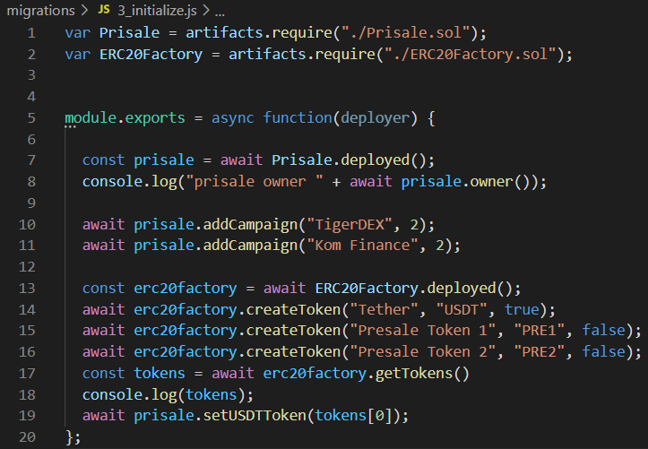

# Port Truffle and React based DApp to Nervos' Polyjuice

## How I ported my Ethereum DApp to Polyjuice (and how you can too)

In this article we'll walk through porting an Ethereum DApp that runs on Truffle and React to Nervos Network's Polyjuice framework.

If you're here, I assume you know what these terms mean, and you have your own DApp you want to port, or at least understand what that entails.

Note that there are a few other resources that might be of interest to you:
- Nervos' team have supplied very clear instructions on how to port a DApp, however, in their example they deploy their contract via the DApp front end. If you're using Truffle for deploying your contracts, that will be less useful to you. [See here](https://gitcoin.co/issue/nervosnetwork/grants/8/100026214).
- If you just want a basic truffle project to use as a base, or to copy it's config file, you can use [simple-storage-v2](https://github.com/RetricSu/simple-storage-v2).
- For other different tutorial on how to port your DApp to Polyjuice, you can see the [Submissions at this hackathon](https://gitcoin.co/issue/nervosnetwork/grants/16/100026367).

But if you have your own DApp using Truffle that you'd like to port, this tutorial is for you and will include all the info from the previous bullet points. Let's begin.

The porting consists of few simple steps:

* Back-end:
  * Change truffle's network to a Godwoken testnet RPC, and set the providers to support Polyjuice.

* Front-end:
  * Change the Web3 provider to one that supports Polyjuice
  * Use a supplied module for translating addresses Ethereum <-> Godwoken
  * 

### Back-end (Truffle)
The DApp I am currently working on hasn't been deployed yet, and my Truffle configuration only consisted of connecting to my local Ganache instance.

To get Truffle to connect and deploy to the Godwoken Testnet, we need to use custom providers for Ethereum libraries that will handle the changes between Ethereum and Godwoken-Polyjuice (such as different transaction structure and different signing mechanism).

Nervos has supplied us with these providers. I was using web3 (and not ethers) so this is the process I will document here.

To load environment variables, I used the dotenv node module.

First we need to install the required dependencies:

```npm install @polyjuice-provider/web3 @polyjuice-provider/truffle dotenv```

Then we add the dependencies to truffle-config.js:
```
const { PolyjuiceHDWalletProvider } = require("@polyjuice-provider/truffle");
const { PolyjuiceHttpProvider } = require("@polyjuice-provider/web3");
```

Now let's create the .env file which will contain the configuration. This configuration has been supplied by the Nervos team - other than the private key, in which you should put your own Ethereum private key.
```
WEB3_JSON_RPC=http://godwoken-testnet-web3-rpc.ckbapp.dev
ROLLUP_TYPE_HASH=0x4cc2e6526204ae6a2e8fcf12f7ad472f41a1606d5b9624beebd215d780809f6a
ETH_ACCOUNT_LOCK_CODE_HASH=0xdeec13a7b8e100579541384ccaf4b5223733e4a5483c3aec95ddc4c1d5ea5b22
PRIVATE_KEY=<ETHEREUM PRIVATE KEY HERE>
```

Back in truffle-config.js, we now need to load the environment variables:
```
const root = require("path").join.bind(this, __dirname, ".");
require("dotenv").config({ path: root(".env") });
```

Now we can access the configuration in truffle-config. Let's set up the custom providers. We set up two: a provider for Truffle (PolyjuiceHDWalletProvider) which will use a provider for web3 (PolyjuiceHttpProvider).
```
const rpc_url = new URL(process.env.WEB3_JSON_RPC);
 
const godwoken_rpc_url = process.env.WEB3_JSON_RPC;
const polyjuice_config = {
  rollupTypeHash: process.env.ROLLUP_TYPE_HASH,
  ethAccountLockCodeHash: process.env.ETH_ACCOUNT_LOCK_CODE_HASH,
  web3Url: godwoken_rpc_url,
};

const polyjuiceHttpProvider = new PolyjuiceHttpProvider(
   polyjuice_config.web3Url,
   polyjuice_config
 );
 const polyjuiceTruffleProvider = new PolyjuiceHDWalletProvider(
   [
     {
       privateKeys: [process.env.PRIVATE_KEY],
       providerOrUrl: polyjuiceHttpProvider,
     },
   ],
   polyjuice_config
 );
```
Now we only need to configure the truffle network to connect to the Godwoken RPC we configured, and use the Polyjuice provider.
```
networks: {
      development: {
       host: rpc_url.hostname, // Localhost (default: none)
       port: rpc_url.port, // Standard Ethereum port (default: none)
       gasPrice: "0", // notice: `gasPrice: 0` won't work in dryRun mode. 0 must be string type.
       network_id: "*", // Any network (default: none)
       provider: () => polyjuiceTruffleProvider,
     }
   }
```
And that's it for truffle-config!

#### The final truffle-config.js file
```
const { PolyjuiceHDWalletProvider } = require("@polyjuice-provider/truffle");
const { PolyjuiceHttpProvider } = require("@polyjuice-provider/web3");

const root = require("path").join.bind(this, __dirname, ".");
require("dotenv").config({ path: root(".env") });

const rpc_url = new URL(process.env.WEB3_JSON_RPC);

const godwoken_rpc_url = process.env.WEB3_JSON_RPC;
const polyjuice_config = {
  rollupTypeHash: process.env.ROLLUP_TYPE_HASH,
  ethAccountLockCodeHash: process.env.ETH_ACCOUNT_LOCK_CODE_HASH,
  web3Url: godwoken_rpc_url,
};

const polyjuiceHttpProvider = new PolyjuiceHttpProvider(
  polyjuice_config.web3Url,
  polyjuice_config
);
const polyjuiceTruffleProvider = new PolyjuiceHDWalletProvider(
  [
    {
      privateKeys: [process.env.PRIVATE_KEY],
      providerOrUrl: polyjuiceHttpProvider,
    },
  ],
  polyjuice_config
);

module.exports = {
  networks: {
    development: {
      host: rpc_url.hostname, // Localhost (default: none)
      port: rpc_url.port, // Standard Ethereum port (default: none)
      gasPrice: "0", // notice: `gasPrice: 0` won't work in dryRun mode. 0 must be string type.
      network_id: "*", // Any network (default: none)
      provider: () => polyjuiceTruffleProvider,
    }
  },

  // Configure your compilers
  compilers: {
    solc: {
      version: "0.7.6"
    },
  },

  db: {
    enabled: false,
  },
};
```

If you followed this far, you can run ```truffle migrate --reset``` and see the contracts being deployed. Make sure your Ethereum address is funded [(see here)](https://gitcoin.co/issue/nervosnetwork/grants/2/100026208).

Note: my truffle deployment is a usual affair:


And after the deployment, I initialise the contracts with some basic values:


At this point, when the contracts have been deployed, we can already see something interesting: the conversion between Ethereum address and Godwoken address. When in the init script I print the contract's owner, I'm getting my Godwoken address.


### Front-end
My DApp instanstiated 
